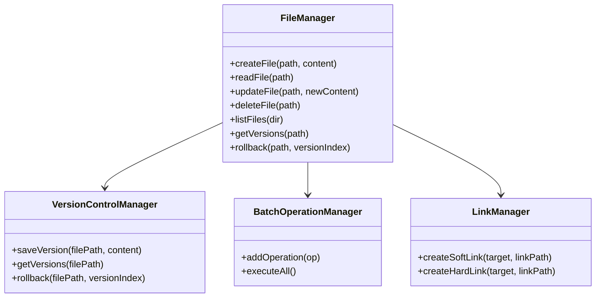

# File Manager System  

## 📌 Overview  
This is a **File Manager application** implemented in **Java**.  
It provides basic file system operations (CRUD), batch execution, link management (hard/soft links), and simple version control for files.  
The project was designed and built as part of an assessment where we first presented the design, then implemented the solution.  

---

## ✨ Features  
- **Basic File Operations**  
  - Create a file  
  - Read file contents  
  - Update file contents (with version tracking)  
  - Delete a file  
  - List all files in a directory  

- **Batch Operations**  
  - Queue multiple file operations and execute them together  

- **Link Management**  
  - Create **hard links**  
  - Create **soft links** (symbolic links) *(Admin/Developer Mode required on Windows)*  

- **Version Control**  
  - Maintains history of file updates (in memory)  
  - Allows rollback to previous versions  

---

## 🛠️ Tech Stack  
- **Language**: Java (JDK 8+)  
- **Libraries**:  
  - `java.nio.file.*` → for file & link management  
  - `java.util.*` → for data structures  

---

## 🚀 How to Run  

### 1. Compile  
```bash
javac FileManagerApp.java
```
### Run
```bash
java FileManagerApp
```
## 📊 System Design


